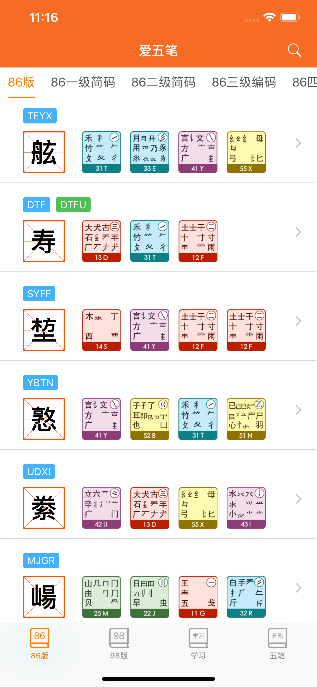
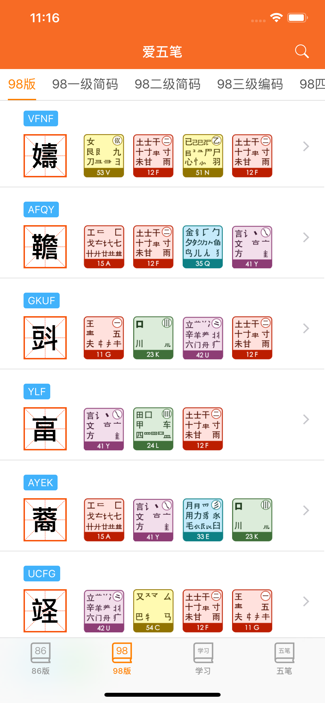
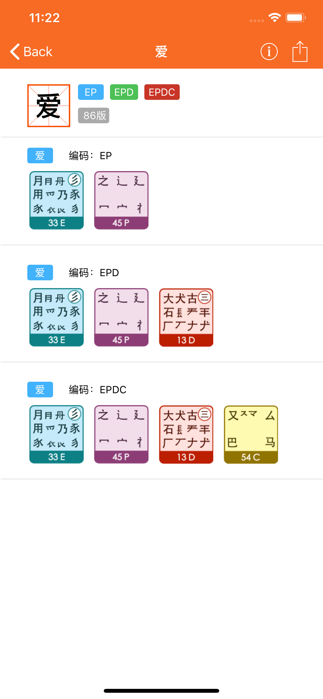
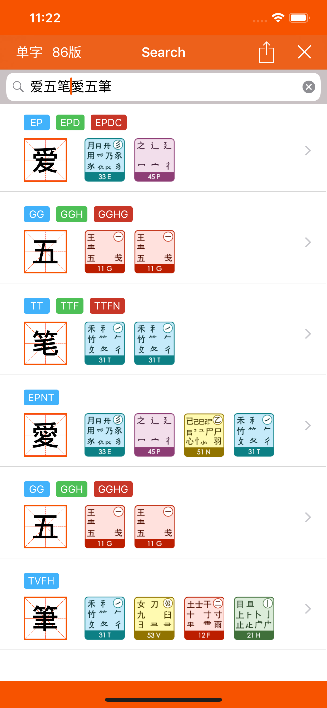
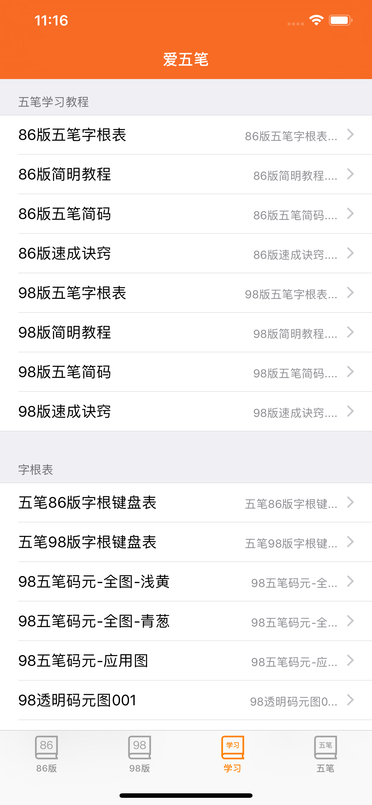
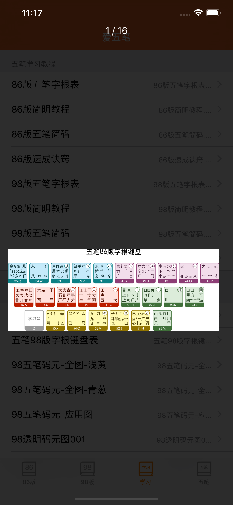

# iWuBi
iWuBi 是一款五笔输入法相关知识的学习App，目的是为了方便初学者学习和快速查询拆字等，防止老司机翻车~

### 项目介绍
#应用简介#

> 爱五笔是一款五笔学习的App，支持86版和98版，简体和繁体字显示！30000+词库，满足你五笔求知欲望！让大家在零碎时间也可以快速和简单的学习get! 

#功能特色#
- 1、30000+词库，满足你五笔求知欲望！
- 2、支持86版和98版，包含简体和繁体字！
- 3、方便强大的交互，全面的五笔学习资料
- 4、更多功能和特色，等待你来发现！

#功能简介#
- v86和98，拆字全解
- 搜索字词，样样精通
- 强大交互，惊喜连连
- 全速体验，百分百爽
- 3D Touch, 快捷搜索

#应用简介#
爱五笔 是一款五笔学习的工具类App，希望打造更好的方式呈现更有趣的知识，让大家在零碎时间也可以快速和简单的学习get!

#功能特色#
- 1、30000+词库，满足你五笔求知欲望！
- 2、支持86版和98版，包含简体和繁体字！
- 3、方便强大的交互，全面的五笔学习资料
- 4、强大的搜索和合词，再无你不认识的五笔编码
- 5、更多功能和特色，等待你来发现和建议！

#我的故事#
- 作为使用五笔输入法已经超过15年的骨灰级用户，我对五笔输入法的喜欢，已经不能单单止于喜爱！所以，App叫“爱五笔”，这是真爱！

#为什么创作这个五笔应用？#
- 一直以来，我也经常遇到不记得一些字怎么拆解，特别是结构很复杂的汉字，很久不打也就忘记怎么打了，看到市面上的App，没有找到一个勉强比较符合的App，所以就一直想做一个自己用的爽的五笔App，特别是能把86和98版本做到一个App里面。所以，我希望有一个五笔学习的App：简单，轻便，快捷，就是爽！

#这个应用有什么特色？#
- 我想说早用早爽，一直用一直爽，一个字用了就赚到啦，五笔我的最爱！爱五笔我最爱！

#为什么选择开源代码？#
- 一方面，收费只是用于续交AppStore年费；所以，你如果有macOS系统，也可以通过 https://github.com/iHTCboy/iWuBi 下载源代码编译安装；

- 另一方面，其实，我内心是希望大家都能用到好用的App，耳目一新的应用，方便高效的应用，虽然这个应用不算是最棒的，但是我希望通过开源的方式，让更多的人学习iOS开发，了解iOS应用，一起为新事物而喜！

#快捷键#
> 适配于 iPad 和 macOS

- 全局

command(⌘) + F：打开搜索页面
command(⌘) + 1/2/3/4：切换 TabBar 标签栏
command(⌘) + Escape：返回（如果是子页面，返回上一页面）

- 局部

搜索页面快捷键：
command(⌘) + T：切换 单词/词组 模式
command(⌘) + 8：切换成搜索86版五笔编码
command(⌘) + 9：切换成搜索98版五笔编码

### 项目学习
- 本App可以学习到 Swift 开发 iOS App的技术。

### 下载地址
- 收费人民币1元，用于 AppStore ￥688 年费。AppStore 下载： [iOS App Store](https://itunes.apple.com/cn/app/iWuBi/id1459028801?l=zh&ls=1&mt=8)

### 应用更新日志

- v5.2.0
> 2020-04-19
1、增加键盘快捷键功能（适用于 iPad 和 macOS）；
2、更新 macOS 图标，更好美观
3、优化应用界面细节和体验

### 应用截图

